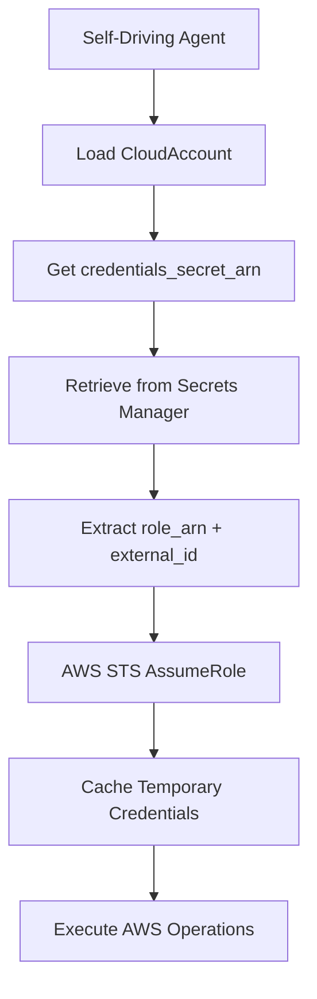

# Cross-Account AWS Operations - Detailed Architecture

## Overview

This document defines the canonical architecture for enabling the self-driving coder agent (`self_driving_coder_agent_tofu.py`) to operate on AWS resources in separate accounts from the control plane. This architecture prioritizes simplicity and leverages the fact that Erie Iron owns all accounts, eliminating complex security controls in favor of a straightforward role-based approach.

## Core Design Principles

1. **Simplicity First**: No complex provisioning lambdas, admission controllers, or cross-account networking
2. **Owner Trust Model**: Since Erie Iron owns all accounts, we use a trusted model with appropriately scoped IAM roles  
3. **OpenTofu-Based**: All infrastructure and permissions provisioned via OpenTofu (Terraform-compatible)
4. **Role Assumption**: Standard AWS role assumption with external IDs for cross-account access
5. **Secret Manager Integration**: All credentials stored in AWS Secrets Manager with consistent naming

## Architecture Components

### 1. Control Plane Account (Erie Iron Account)
**Purpose**: Hosts the self-driving coder agent and orchestrates all target account operations

**Components**:
- **Self-Driving Coder Agent**: `self_driving_coder_agent_tofu.py` running in ECS
- **Credential Storage**: AWS Secrets Manager with target account role credentials
- **State Management**: OpenTofu state stored centrally for all target accounts
- **CloudAccount Model**: Database records tracking all target accounts and their configurations

### 2. Target Accounts
**Purpose**: Isolated AWS accounts where business infrastructure is deployed

**Components**:
- **Cross-Account IAM Role**: `ErieIronTargetAccountAgentRole` - this is the specific role that the Erie Iron orchestration code (self_driving_coder_agent_tofu.py) assumes when running operations in the target account
- **Permission Policies**: Comprehensive permissions for all agent operations including ECS, ECR, S3, RDS, IAM, and infrastructure deployment
- **Resource Tags**: Consistent tagging for cost tracking and management
- **External ID**: Security measure for role assumption validation between control plane and target account

### 3. Infrastructure Stack Types

**Enhanced InfrastructureStackType Enum**:
```python
class InfrastructureStackType(BaseErieIronEnum):
    FOUNDATION = "foundation"
    APPLICATION = "application"
    TARGET_ACCOUNT_BOOTSTRAP = "target_account_bootstrap"  # NEW
```

**Stack Configuration Mapping**:
```
TARGET_ACCOUNT_BOOTSTRAP → ./opentofu/target_account_provisioning/stack.tf (new stack for target account setup)
```

**Note**: The existing foundation and application stacks are unchanged and are deployed using the existing orchestration layer. This cross-account initiative focuses solely on enabling cross-account access through credential resolution and role assumption.

## Authentication Flow

### 1. Role Assumption Workflow


### 2. Credential Storage Structure
**Secret Name Pattern**: `{business_secrets_root}/cloud-accounts/{account_id}`

**Secret Payload**:
```json
{
  "role_arn": "arn:aws:iam::TARGET_ACCOUNT:role/ErieIronTargetAccountAgentRole",
  "external_id": "unique-external-id-for-security",
  "session_name": "erieiron-{account_id}",
  "session_duration": 3600
}
```

### 3. Agent Implementation Changes
**File**: `self_driving_coder_agent_tofu.py`

**Modified build_cloud_credentials() Function**:
```python
def build_cloud_credentials(business, initiative, stack_type, env_type):
    # Existing logic for CloudAccount resolution...
    
    if cloud_account and cloud_account.credentials_secret_arn:
        # NEW: Target account role assumption
        return assume_target_account_role(cloud_account)
    else:
        # Existing: Use control plane credentials
        return build_boto3_session()
```

**New assume_target_account_role() Function**:
```python
def assume_target_account_role(cloud_account):
    secret_payload = load_credentials_secret(cloud_account)
    
    sts_client = boto3.client('sts')
    response = sts_client.assume_role(
        RoleArn=secret_payload['role_arn'],
        RoleSessionName=secret_payload.get('session_name', f'erieiron-{cloud_account.account_identifier}'),
        ExternalId=secret_payload.get('external_id'),
        DurationSeconds=secret_payload.get('session_duration', 3600)
    )
    
    return response['Credentials']
```

## OpenTofu Infrastructure Configuration

### 1. Target Account Bootstrap Stack Structure
**Stack Name**: `TARGET_ACCOUNT_BOOTSTRAP` (maps to `InfrastructureStackType.TARGET_ACCOUNT_BOOTSTRAP`)
**File**: `./opentofu/target_account_provisioning/stack.tf`

This is the dedicated OpenTofu stack for Phase 2: Target Account Bootstrap operations. All target account resource provisioning (IAM roles, policies, etc.) takes place via this .tf file.

**Key Resources**:
- IAM role with trust policy to control plane account
- IAM policy attachment using permission template
- Resource tagging for identification
- Output values for role ARN and external ID

### 2. Permission Template
**File**: `./opentofu/target_account_provisioning/target_account_agent_permissions.json.tftpl`

**Permission Categories**:
- **Container Services**: ECS, ECR, CloudWatch Logs (Full Access)
- **Infrastructure**: EC2, VPC, Security Groups, Load Balancers
- **Storage**: S3, RDS, DynamoDB
- **Security**: IAM, Secrets Manager, Certificate Manager
- **Networking**: Route53, CloudFront
- **Monitoring**: CloudWatch, CloudTrail

### 3. Variable Injection
**OpenTofu Variables**:
```hcl
variable "control_plane_account_id" {
  description = "AWS account ID of the control plane"
  type        = string
}

variable "external_id" {
  description = "External ID for role assumption security"
  type        = string
  sensitive   = true
}

variable "business_name" {
  description = "Business name for resource naming"
  type        = string
}
```

## Deployment Scripts

### 1. Script Directory Structure
```
./scripts/
└── apply_target_account_bootstrap.sh  # Target account setup
```

### 2. Target Account Bootstrap Script
**Purpose**: Setup cross-account IAM role and permissions

**Parameters**:
- Target AWS account ID
- Business identifier
- Environment type (dev/production)

**Operations**:
- Deploy target account bootstrap stack
- Output role ARN and external ID
- Store credentials in control plane Secrets Manager

## Database Model Extensions

### 1. CloudAccount Model Enhancements
**No Changes Required**: Existing model supports all necessary fields

**Key Fields for Target Accounts**:
- `account_identifier`: Target AWS account ID
- `credentials_secret_arn`: Reference to stored role credentials
- `is_default_dev`/`is_default_production`: Environment-specific defaults

### 2. InfrastructureStack Model
**Enhanced stack_type field** to support `TARGET_ACCOUNT_BOOTSTRAP`

## Security Considerations

### 1. External ID Usage
- Unique external ID generated per target account
- Stored securely in Secrets Manager
- Prevents unauthorized role assumption

### 2. Credential Lifecycle
- Temporary credentials with 1-hour expiration
- Automatic refresh 5 minutes before expiration
- In-memory caching with secure cleanup

### 3. Permission Scope
- Least-privilege principle applied to all permissions
- Regular audit of permission templates
- Resource-level restrictions where appropriate

## LLM Implementation Guidelines

### 1. When Implementing This Architecture:
1. **Start with OpenTofu configurations**: Create templates before modifying agent code
2. **Test role assumption first**: Verify cross-account access before full implementation  
3. **Use existing patterns**: Follow established OpenTofuStackManager patterns
4. **Maintain simplicity**: Resist adding complexity; owner trust model is sufficient

### 2. Key Files to Modify:
- `self_driving_coder_agent_tofu.py`: Add role assumption logic
- `./opentofu/target_account_provisioning/stack.tf`: Create bootstrap configuration
- `./scripts/apply_target_account_bootstrap.sh`: Create deployment script

### 3. Testing Strategy:
1. Create test target account
2. Deploy bootstrap infrastructure
3. Verify role assumption from control plane
4. Test end-to-end infrastructure deployment
5. Validate cleanup and teardown procedures

## Future Considerations

### 1. Multi-Region Support
- Regional credential caching
- Region-specific role creation
- Cross-region state management

### 2. Compliance Integration
- Automated compliance checking
- Policy validation pipelines  
- Audit trail integration

### 3. Cost Optimization
- Cross-account cost allocation
- Resource lifecycle management
- Automated cleanup procedures

This architecture provides a robust, simple foundation for cross-account AWS operations while maintaining security best practices and operational simplicity.