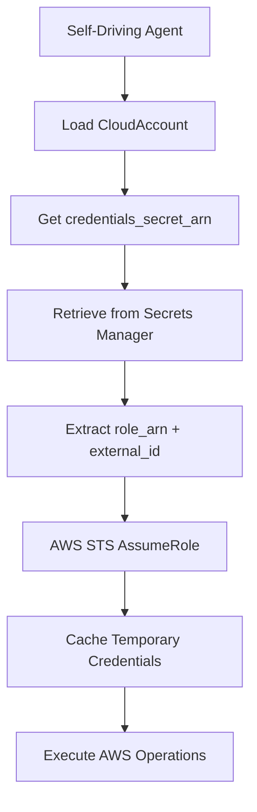

# Cross-Account AWS Operations - Detailed Architecture

## Overview

This document defines the canonical architecture for enabling the self-driving coder agent (`self_driving_coder_agent_tofu.py`) to operate on AWS resources in separate accounts from the control plane. This architecture prioritizes simplicity and leverages the fact that Erie Iron owns all accounts, eliminating complex security controls in favor of a straightforward role-based approach.

## Core Design Principles

1. **Simplicity First**: No complex provisioning lambdas, admission controllers, or cross-account networking
2. **Owner Trust Model**: Since Erie Iron owns all accounts, we use a trusted model with appropriately scoped IAM roles  
3. **OpenTofu-Based**: All infrastructure and permissions provisioned via OpenTofu (Terraform-compatible)
4. **Role Assumption**: Standard AWS role assumption with external IDs for cross-account access
5. **Secret Manager Integration**: All credentials stored in AWS Secrets Manager with consistent naming

## Architecture Components

### 1. Control Plane Account (Erie Iron Account)
**Purpose**: Hosts the self-driving coder agent and orchestrates all target account operations

**Components**:
- **Self-Driving Coder Agent**: `self_driving_coder_agent_tofu.py` running in ECS
- **Credential Storage**: AWS Secrets Manager with target account role credentials
- **State Management**: OpenTofu state stored centrally for all target accounts
- **CloudAccount Model**: Database records tracking all target accounts and their configurations

### 2. Target Accounts
**Purpose**: Isolated AWS accounts where business infrastructure is deployed

**Components**:
- **Cross-Account IAM Role**: `ErieIronTargetAccountAgentRole` - this is the specific role that the Erie Iron orchestration code (self_driving_coder_agent_tofu.py) assumes when running operations in the target account
- **Permission Policies**: Comprehensive permissions for all agent operations including ECS, ECR, S3, RDS, IAM, and infrastructure deployment
- **Resource Tags**: Consistent tagging for cost tracking and management
- **External ID**: Security measure for role assumption validation between control plane and target account

### 3. Infrastructure Stack Types

**Enhanced InfrastructureStackType Enum**:
```python
class InfrastructureStackType(BaseErieIronEnum):
    FOUNDATION = "foundation"
    APPLICATION = "application"
    TARGET_ACCOUNT_BOOTSTRAP = "target_account_bootstrap"  # NEW
```

**Stack Configuration Mapping**:
```
TARGET_ACCOUNT_BOOTSTRAP → ./opentofu/target_account_provisioning/stack.tf (new stack for target account setup)
FOUNDATION → ./opentofu/foundation/stack.tf (existing foundation stack)
APPLICATION → ./opentofu/application/stack.tf (existing application stack)
```

### 4. OpenTofu State Management

**S3 State Storage Architecture**:
All OpenTofu state is stored in S3 buckets with a consistent, derivable naming pattern:

**Bucket Naming Convention**:
```
erieiron-opentofu-state-{sanitized_business_name}-{account_id}
```

**State Key Pattern**:
```
{business_name}/{account_id}/{stack_namespace_token}/stack.tfstate
```

**Key Features**:
- **Derivable Names**: Bucket names and keys can be calculated from business and account context
- **Account Isolation**: Each account gets its own state bucket
- **Versioning**: S3 bucket versioning enabled for state history
- **Encryption**: Server-side encryption (AES256) for state security
- **DynamoDB Locking**: State locking table `opentofu-locks` in target accounts

**State Management Implementation**:
The `opentofu_stack_manager.py` automatically generates bucket names and keys for all stack types using the same logic as the bootstrap scripts.

## Authentication Flow

### 1. Role Assumption Workflow


### 2. Credential Storage Structure
**Secret Name Pattern**: `{business_secrets_root}/cloud-accounts/{account_id}`

**Secret Payload**:
```json
{
  "role_arn": "arn:aws:iam::TARGET_ACCOUNT:role/ErieIronTargetAccountAgentRole",
  "external_id": "unique-external-id-for-security",
  "session_name": "erieiron-{account_id}",
  "session_duration": 3600
}
```

### 3. Agent Implementation Changes
**File**: `self_driving_coder_agent_tofu.py`

**Modified build_cloud_credentials() Function**:
```python
def build_cloud_credentials(business, initiative, stack_type, env_type):
    # Existing logic for CloudAccount resolution...
    
    if cloud_account and cloud_account.credentials_secret_arn:
        # NEW: Target account role assumption
        return assume_target_account_role(cloud_account)
    else:
        # Existing: Use control plane credentials
        return build_boto3_session()
```

**New assume_target_account_role() Function**:
```python
def assume_target_account_role(cloud_account):
    secret_payload = load_credentials_secret(cloud_account)
    
    sts_client = boto3.client('sts')
    response = sts_client.assume_role(
        RoleArn=secret_payload['role_arn'],
        RoleSessionName=secret_payload.get('session_name', f'erieiron-{cloud_account.account_identifier}'),
        ExternalId=secret_payload.get('external_id'),
        DurationSeconds=secret_payload.get('session_duration', 3600)
    )
    
    return response['Credentials']
```

## OpenTofu Infrastructure Configuration

### 1. Target Account Bootstrap Stack Structure
**Stack Name**: `TARGET_ACCOUNT_BOOTSTRAP` (maps to `InfrastructureStackType.TARGET_ACCOUNT_BOOTSTRAP`)
**File**: `./opentofu/target_account_provisioning/stack.tf`

This is the dedicated OpenTofu stack for Phase 1: Target Account Bootstrap operations. All target account resource provisioning (IAM roles, policies, state infrastructure, etc.) takes place via this .tf file.

**Key Resources**:
- IAM role with trust policy to control plane account
- IAM policy attachment using permission template
- DynamoDB table for OpenTofu state locking
- Resource tagging for identification
- Output values for role ARN and external ID

**State Infrastructure**:
- S3 bucket for OpenTofu state storage (created via AWS CLI before OpenTofu initialization)
- DynamoDB table `opentofu-locks` for state locking
- S3 backend configuration with dynamic bucket parameters

### 2. Permission Template
**File**: `./opentofu/target_account_provisioning/target_account_agent_permissions.json.tftpl`

**Permission Categories**:
- **Container Services**: ECS, ECR, CloudWatch Logs (Full Access)
- **Infrastructure**: EC2, VPC, Security Groups, Load Balancers
- **Storage**: S3, RDS, DynamoDB
- **Security**: IAM, Secrets Manager, Certificate Manager
- **Networking**: Route53, CloudFront
- **Monitoring**: CloudWatch, CloudTrail

### 3. Variable Injection
**OpenTofu Variables**:
```hcl
variable "control_plane_account_id" {
  description = "AWS account ID of the control plane"
  type        = string
}

variable "external_id" {
  description = "External ID for role assumption security"
  type        = string
  sensitive   = true
}

variable "business_name" {
  description = "Business name for resource naming"
  type        = string
}
```

## Deployment Scripts - Two-Phase Architecture

### 1. Script Directory Structure
```
./scripts/
├── apply_target_account_bootstrap.sh           # Main orchestrator script
├── bootstrap_phase1_target_account.sh          # Phase 1: Target account operations
└── bootstrap_phase2_control_plane.sh           # Phase 2: Control plane operations
```

### 2. Two-Phase Bootstrap Process
**Design Rationale**: The bootstrap process is split into two phases to solve credential separation issues. Django settings initialization requires database access, but attempting to access the control plane database using target account credentials causes authentication failures.

#### **Phase 1: Target Account IAM Role Creation**
**Script**: `./scripts/bootstrap_phase1_target_account.sh`
**Credential Context**: Target account credentials (via `AWS_PROFILE`)

**Purpose**: Create infrastructure in target account without Django dependencies

**Parameters**:
- Target AWS account ID
- Business identifier  
- Environment type (dev/production)
- External ID (generated by main script)

**Operations**:
- Validate target account credentials
- Create S3 bucket for OpenTofu state storage with versioning and encryption
- Deploy target account bootstrap OpenTofu stack with S3 backend
- Create `ErieIronTargetAccountAgentRole` with permissions
- Create DynamoDB table `opentofu-locks` for state locking  
- Output role ARN and external ID to temporary file
- Verify IAM role creation

**Key Benefits**:
- No Django database access = No credential conflicts
- Direct OpenTofu deployment using target account credentials
- Isolated IAM role creation process
- Self-contained state management infrastructure in target account

#### **Phase 2: Control Plane Integration**  
**Script**: `./scripts/bootstrap_phase2_control_plane.sh`
**Credential Context**: Control plane credentials (auto-detected profile)

**Purpose**: Store credentials and create database records using control plane access

**Parameters**:
- Phase 1 output file path (contains role information)

**Operations**:
- Validate control plane credentials  
- Read role information from Phase 1 output
- Test cross-account role assumption
- Store credentials in control plane Secrets Manager
- Create CloudAccount database record using `LOCAL_DB_NAME` 
- Set cloud account as default for environment
- Verify end-to-end setup

**Key Benefits**:
- Uses appropriate credentials for each operation
- Django database access works correctly
- Prevents AWS Secrets Manager access conflicts

#### **Main Orchestrator Script**
**Script**: `./scripts/apply_target_account_bootstrap.sh`
**Purpose**: Coordinates both phases with automatic credential switching

**Enhanced Operations**:
- Generate secure external ID
- Generate OpenTofu state bucket configuration with sanitized business name
- Execute Phase 1 with target account credentials (includes S3 bucket creation)
- Automatic control plane profile detection (`erieiron-control`, `erieiron`, or `default`)
- Switch `AWS_PROFILE` between phases
- Execute Phase 2 with control plane credentials
- Final verification using appropriate credentials for each check
- Comprehensive error handling and rollback capability

**State Management Features**:
- Automatic S3 bucket name generation: `erieiron-opentofu-state-{sanitized_business_name}-{account_id}`
- Business name sanitization for S3 compliance (lowercase, alphanumeric + hyphens)
- Bucket name length validation (≤63 characters)
- State key pattern: `{business_name}/{account_id}/target-account-bootstrap/terraform.tfstate`

## Database Model Extensions

### 1. CloudAccount Model Enhancements
**No Changes Required**: Existing model supports all necessary fields

**Key Fields for Target Accounts**:
- `account_identifier`: Target AWS account ID
- `credentials_secret_arn`: Reference to stored role credentials
- `is_default_dev`/`is_default_production`: Environment-specific defaults

### 2. InfrastructureStack Model
**Enhanced stack_type field** to support `TARGET_ACCOUNT_BOOTSTRAP`

### 3. Django Management Commands
**New Command**: `bootstrap_target_account_phase2`
**Purpose**: Phase 2-only operations for control plane integration

**Key Features**:
- No OpenTofu deployment (handled in Phase 1)
- Input validation for role ARN and external ID from Phase 1
- Credential storage in Secrets Manager
- CloudAccount database record creation
- Environment-specific default flag management
- Cross-account access validation

**Usage**:
```bash
python manage.py bootstrap_target_account_phase2 \
    TARGET_ACCOUNT_ID \
    BUSINESS_NAME \
    ENV_TYPE \
    --role-arn "arn:aws:iam::123456789012:role/ErieIronTargetAccountAgentRole" \
    --external-id "secure-external-id-from-phase1"
```

## Security Considerations

### 1. External ID Usage
- Unique external ID generated per target account
- Stored securely in Secrets Manager
- Prevents unauthorized role assumption

### 2. Credential Lifecycle
- Temporary credentials with 1-hour expiration
- Automatic refresh 5 minutes before expiration
- In-memory caching with secure cleanup

### 3. Permission Scope
- Least-privilege principle applied to all permissions
- Regular audit of permission templates
- Resource-level restrictions where appropriate

## LLM Implementation Guidelines

### 1. When Implementing This Architecture:
1. **Start with OpenTofu configurations**: Create templates before modifying agent code
2. **Test role assumption first**: Verify cross-account access before full implementation  
3. **Use existing patterns**: Follow established OpenTofuStackManager patterns
4. **Maintain simplicity**: Resist adding complexity; owner trust model is sufficient

### 2. Key Files to Modify:
- `self_driving_coder_agent_tofu.py`: Add role assumption logic
- `./opentofu/target_account_provisioning/stack.tf`: Create bootstrap configuration
- `./scripts/apply_target_account_bootstrap.sh`: Create deployment script

### 3. Testing Strategy:
**Phase 1 Testing**:
1. Create test target account with admin access
2. Configure AWS SSO profile for target account
3. Run Phase 1 script with target account credentials
4. Verify IAM role created in target account
5. Validate role information output file structure

**Phase 2 Testing**:
6. Configure control plane AWS profile
7. Run Phase 2 script with control plane credentials  
8. Verify cross-account role assumption test passes
9. Validate Secrets Manager credential storage
10. Confirm CloudAccount database record creation

**Integration Testing**:
11. Run full two-phase bootstrap via main script
12. Test automatic credential profile switching
13. Verify end-to-end infrastructure deployment using created role
14. Validate cleanup and teardown procedures for both phases

**Error Handling Testing**:
15. Test credential validation failures in each phase
16. Verify graceful handling of partial completion
17. Test recovery from failed Phase 1 operations
18. Validate rollback procedures when Phase 2 fails

## Future Considerations

### 1. Multi-Region Support
- Regional credential caching
- Region-specific role creation
- Cross-region state management

### 2. Compliance Integration
- Automated compliance checking
- Policy validation pipelines  
- Audit trail integration

### 3. Cost Optimization
- Cross-account cost allocation
- Resource lifecycle management
- Automated cleanup procedures

This architecture provides a robust, simple foundation for cross-account AWS operations while maintaining security best practices and operational simplicity.